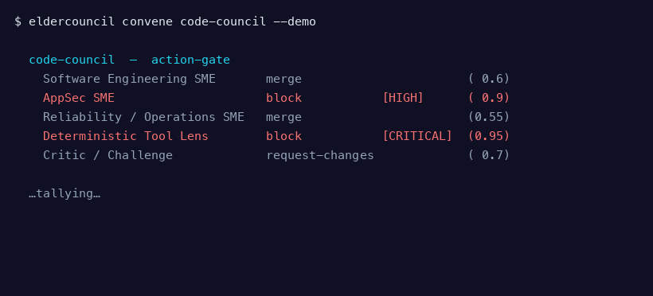
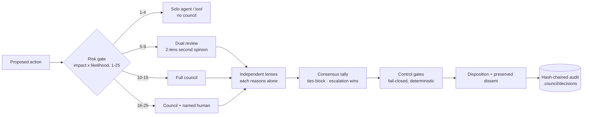

<!-- SPDX-License-Identifier: CC-BY-4.0 -->
<div align="center">

# Elder Council Harness

### Don't let one model decide alone.

**Convene the council. Keep the dissent. Own the decision.**

[](LICENSE)
[](LICENSE-DOCS)
[](CHANGELOG.md)
[](pyproject.toml)
[](docs/TESTING.md)
[](docs/STANDARDS-MAP.md)
[](docs/STANDARDS-MAP.md)

*Multi-model **councils** for high-stakes decisions — built for cyber, and for any call too consequential to leave to one model alone. Convened only when the decision is worth it.*



</div>

---

## The problem: one model, everywhere, is a single point of failure

When one model reviews your code, triages your alerts, vets your dependencies, interprets your
compliance obligations, scores your risk — and weighs your bet-the-business calls — its blind spots
stop being an isolated bad answer. They become a **repeatable pattern inside your decision
infrastructure** — propagating through teams, tools, and downstream systems at machine speed. A
confident, stale, biased, or manipulated model becomes a **systemic risk**: a single point of
institutional failure.

Elder Council is the response: **selective plurality**. Use a single agent or a deterministic tool
where that is enough — and convene a structured, multi-lens **council** only when a decision is
consequential, uncertain, adversarial, or expensive to get wrong. A council is not a committee for
every task. It is a risk-governance pattern for the decisions that matter — **built for cyber**
(where the councils, lenses, and threat model run deepest) and general enough for any high-stakes
call, including the **executive Business Decision** council. See [the councils](docs/COUNCILS.md) and
[domain adaptation](docs/DOMAIN-ADAPTATION.md).

> A council is **decision support, not a guarantee**. Councils can be wrong. A named human owns every
> critical and risk-acceptance decision. The audit trail is **tamper-evident, not tamper-proof**.

## See a council decide (no keys, no setup)

```console
$ eldercouncil convene code-council --demo --question "merge a diff with a hardcoded AWS key"

  code-council  —  action-gate · can block automatically
    Software Engineering SME       merge                       ( 0.6)  Clean structure, tests pass.
    AppSec SME                     block           [HIGH]      ( 0.9)  Hardcoded secret + unparameterised SQL in the diff.
    Reliability / Operations SME   merge                       (0.55)  Rollback path exists.
    Deterministic Tool Lens        block           [CRITICAL]  (0.95)  secret-scan: AWS key detected; SAST: SQLi sink.
    Critic / Challenge             request-changes             ( 0.7)  Auth check is assumed, not verified, on the new route.

  COUNCIL VERDICT: block   → route: human
  a lens rated this CRITICAL (Deterministic Tool Lens) — blocked pending human review
  dissent preserved: 3 lens(es) disagreed
  GATES (standard): allow  — no safety gate tripped; the council sets the routing
  DISPOSITION: human (the final call — a person decides)
  decision EC-9c65a3c2cd4f
```

Five independent lenses, each with a confidence; a verdict; the **dissent kept on the record**; and a
tamper-evident audit entry. The CRITICAL that blocks comes from the deterministic **tool** lens (an
authoritative scanner finding), not one reasoning model's opinion — and the lenses that wanted to
merge are preserved, not averaged away. The one thing a single model can't show you is where it might
be wrong. `--demo` uses deterministic sample votes so it runs keyless; the real path runs the lenses
on your own models. *(Want to see the failure a council can **not** catch? `convene code-council
--demo --scenario monoculture` shows five lenses sharing one blind spot.)*

> **Not a cyber call?** `eldercouncil convene business-decision --demo` runs the *same machinery* on a
> $40M M&A decision — Finance defers on runway, the Critic rejects an unstressed synergy number — and
> the verdict (`defer`) routes to a named human with the dissent preserved.

## How it works



1. **Risk gate** scores each action (impact × likelihood, 1–25). Below the convene threshold, a
   single agent or a deterministic tool handles it — councils are not convened for routine work.
2. **The council** fans out to independent lenses (technical, security, compliance, a devil's
   advocate, a pragmatic operator). Each reasons **before** synthesis.
3. **Consensus** combines the votes under fail-closed minimum-governance rules: ties block, escalation
   wins, and risk-acceptance or critical actions always route to a named human.
4. **Control gates** — 11 deterministic, fail-closed gates (evidence, action-safety, data-sensitivity,
   a non-overridable offensive-misuse **hard stop**, production-change…) run *around* the council: a
   gate can withhold an action the council voted to permit. Pick a **profile** — Lite / Standard /
   Regulated. See [docs/GATES.md](docs/GATES.md).
5. **Audit** records the verdict, every vote, the gate outcomes, and the **dissent** to a hash-chained,
   tamper-evident log under `.council/`.

## The councils

Six cyber councils, plus a general **Business Decision** council for executive calls:

| Council | Convene it for | Mode |
|---|---|---|
| **Code** | code changes touching security, auth, privacy, or production stability | action-gate |
| **Threat Hunting** | a suspicious signal or possible compromise in a live environment | advisory |
| **Supply Chain Audit** | a new dependency, package, vendor, or build-pipeline integration | action-gate |
| **Multi-Jurisdictional Compliance** | a decision spanning regulatory regimes or data residency | advisory |
| **Cyber Risk** | risk acceptance, control gaps, or remediation sequencing | advisory |
| **Platform Architecture** | an architecture decision with long-term, hard-to-reverse trade-offs | advisory |
| **Business Decision** | a business-critical, high-spend, or hard-to-reverse executive call (M&A, market entry, big bets) | advisory |

Each council ships as pure data (`eldercouncil/councils/*.yaml`) and installs into every supported
IDE. See [docs/COUNCILS.md](docs/COUNCILS.md).

## Quick start

```console
# Not yet on PyPI (alpha) — install from source for now; ships no model and no API keys (BYO LLM):
git clone https://github.com/Cyber-Elders/elder-council-harness && cd elder-council-harness
pip install -e .

eldercouncil init                   # guided: pick your agent + which councils to install
# or, non-interactively:
eldercouncil install claude-code --all
eldercouncil convene code-council --demo   # watch a council decide, keyless
```

`eldercouncil install <ide>` wires the councils into your coding agent and installs a pre-tool gate
that asks you to convene the right council on high-risk actions. The councils run on **your agent's
own model(s)** — Elder Council ships no keys.

> **New here, or not a developer?** [**docs/GET-STARTED.md**](docs/GET-STARTED.md) walks the whole thing
> — install → what changed → how you actually *use* a council — in plain English. Want to run it on
> **your own local models** (Ollama, fully offline)? → [docs/CLAUDE-CODE-OLLAMA.md](docs/CLAUDE-CODE-OLLAMA.md).

## Supported IDEs

| Agent | Enforcement |
|---|---|
| **Claude Code** · **OpenCode** | hard block (pre-tool hook) |
| **Kiro** | hard block (best-effort, pending live verification) |
| **Cursor** · **GitHub Copilot** · any **MCP** client | advisory (the agent is asked to call the gate and honour it) |

*"Hard block" = the agent is physically stopped before the action runs (via a **pre-tool hook** — a checkpoint the agent runs before each action). "Advisory" = the agent is **asked** to convene and comply, but isn't forced to. **MCP** (Model Context Protocol) is the standard way an agent connects to external tools.*

Full matrix and per-IDE behaviour: [docs/IDE-SUPPORT.md](docs/IDE-SUPPORT.md).

## How this relates to Elder Mind

[Elder Mind Harness](https://github.com/Cyber-Elders/elder-mind-harness) is our sibling tool — an
action-level governance gate for coding agents.

| | Governs | Question it answers |
|---|---|---|
| **Elder Mind** (the action-level gate) | the **action** | "Should this *tool call* run?" |
| **Elder Council** (this repo) | the **decision** | "Is one model's judgement enough here, or do we need plural scrutiny?" |

They compose: Elder Mind gates the individual action; Elder Council convenes plural judgement on the
consequential decision behind it. Neither requires the other.

## How it compares

| | Single strong agent | Human committee | Generic multi-agent framework | **Elder Council** |
|---|---|---|---|---|
| Cross-model diversity | ✗ | n/a | sometimes | **yes (BYO, cross-family)** |
| Convenes only when warranted | n/a | rarely | no (runs always) | **yes (risk-gated)** |
| Dissent preserved + audited | ✗ | minutes | ✗ | **yes** |
| Human owns critical calls | depends | yes | ✗ | **yes (enforced)** |
| Ships no keys / no lock-in | n/a | n/a | varies | **yes** |

## What it does NOT do

This is an honest tool. It is **out of scope** for it to:

- **Guarantee a correct decision.** Councils can be wrong; the verdict is decision support. A named
  human owns every critical and risk-acceptance call — **risk acceptance is never automated**.
- **Replace single agents everywhere.** Over-using councils adds cost and noise without benefit;
  reserve them for consequential, uncertain, or adversarial decisions (selective plurality).
- **Provide legal, regulatory, or compliance advice.** Council output is **model-generated and may be
  wrong or stale**; the Compliance council's references are illustrative — configure for your
  jurisdiction and have qualified counsel verify.
- **Resist a determined local tamperer.** The audit is **tamper-evident, not tamper-proof** — record
  the chain head off-box (see [THREAT_MODEL.md](THREAT_MODEL.md)).
- **Ship or manage your model access.** It **ships no keys** — you bring your own LLM. You pin which
  model plays each lens (and re-pin as models change). Because a provider can become unavailable
  (export controls, sanctions, licensing), critical councils should configure fallback models and a
  local/offline option. And note: a council whose lenses all share one model has *correlated* blind
  spots — the very failure it exists to prevent (see [THREAT_MODEL.md](THREAT_MODEL.md)). Diversify
  your models; `eldercouncil models check` warns you if they're all one provider.

## Documentation

| Start here | Then |
|---|---|
| [docs/GET-STARTED.md](docs/GET-STARTED.md) — **install & first run (plain English)** | [START-HERE.md](START-HERE.md) — pick your path |
| [docs/CONCEPT.md](docs/CONCEPT.md) — the why | [docs/CLAUDE-CODE-OLLAMA.md](docs/CLAUDE-CODE-OLLAMA.md) — run on your own local models (Ollama) |
| [docs/COUNCILS.md](docs/COUNCILS.md) — the councils | [docs/LENSES.md](docs/LENSES.md) — the six lenses |
| [docs/LOOP-ENGINEERING.md](docs/LOOP-ENGINEERING.md) — the decision loop (how it fits the agent loop) | [docs/ARCHITECTURE.md](docs/ARCHITECTURE.md) — how it's built |
| [docs/GATES.md](docs/GATES.md) — the 11 control gates + profiles | [docs/DOMAIN-ADAPTATION.md](docs/DOMAIN-ADAPTATION.md) — beyond cyber |
| [docs/METHODOLOGY.md](docs/METHODOLOGY.md) — the full method | [docs/IDE-SUPPORT.md](docs/IDE-SUPPORT.md) — install per IDE |
| [docs/STANDARDS-MAP.md](docs/STANDARDS-MAP.md) — OWASP/NIST | [docs/LICENSING.md](docs/LICENSING.md) — licensing |
| [docs/TESTING.md](docs/TESTING.md) — how it's tested | [THREAT_MODEL.md](THREAT_MODEL.md) — the honest edges |
| [docs/GLOSSARY.md](docs/GLOSSARY.md) · [docs/FAQ.md](docs/FAQ.md) | [docs/MODEL-GUIDANCE.md](docs/MODEL-GUIDANCE.md) — choosing models per role (IDE-aware, local, hybrid) |

## Contributing & security

Contributions welcome — see [CONTRIBUTING.md](CONTRIBUTING.md) and [GOVERNANCE.md](GOVERNANCE.md).
Report a vulnerability privately via [SECURITY.md](SECURITY.md) (not a public issue). We follow the
[Contributor Covenant](CODE_OF_CONDUCT.md). If the systemic-single-model-risk thesis resonates,
**star the repo** and open an issue with your council ideas.

## License

Code: [Apache-2.0](LICENSE). Documentation: [CC BY 4.0](LICENSE-DOCS). See [docs/LICENSING.md](docs/LICENSING.md).
Elder Council reduces decision risk; it does not eliminate it. Provided **as is**, without warranty.

© 2026 ZenBlue Pty Ltd t/a Cyber Elders
