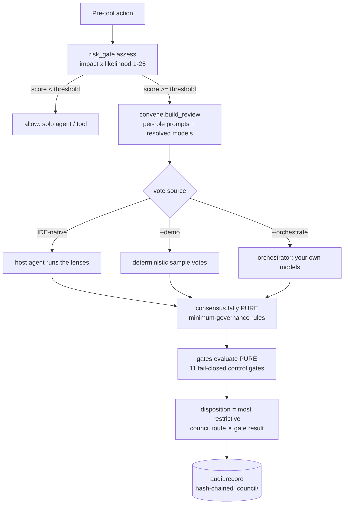

<!-- SPDX-License-Identifier: CC-BY-4.0 -->
# Architecture

Elder Council is a small, stdlib-first Python package. Its defining property is a **hard boundary
between the deterministic core and the non-deterministic deliberation**: everything that decides *how*
votes combine is pure and offline; the only non-deterministic step (the LLM lenses) is injected, so
the whole decision path is testable without a model or the network.

## The decision loop

This is the deterministic inner loop wrapped around the model lenses. For how it sits inside an agent's
turn-by-turn engineering loop — and why that framing matters — see [LOOP-ENGINEERING.md](LOOP-ENGINEERING.md).

## Deterministic core (pure · offline · unit-tested)

| Module | Responsibility |
|---|---|
| `risk_gate` | impact × likelihood scoring (1–25) + route (SOLO / DUAL / FULL_COUNCIL / +HUMAN) |
| `consensus` | `tally(votes, council)` — combine votes under the minimum-governance fail-closed rules |
| `gates` | `evaluate(profile, signals, …)` — the 11 deterministic control gates (`gate-policy.yaml`); a gate can block/escalate even when the council approved. Offensive-misuse is a non-overridable hard stop |
| `audit` | hash-chained, tamper-evident decision records + dissent + gate outcomes + `verify` |
| `schema` | `Council` / `Role` dataclasses + strict validation (fail-closed on malformed) |
| `catalog` | load + validate + merge council definitions (bundled + project overrides) |
| `models` | `council-models.json` loader + role→model resolution + fallback + unresolved-sentinel reporting |
| `convene` | `build_review` — council → per-role BYO-LLM deliberation tasks (no model call) |
| `config` / `paths` | `.council/config.toml` loader; `.council/` path resolution |

None of these touch a model, the network, or randomness. The only wall-clock value is the audit
event's timestamp; the **decision id is a content hash**, so the same votes + council produce an
identical record.

## The injected seam (non-deterministic)

`engine.convene_with_votes(council, question, votes, registry)` takes votes from an **injected source**:

- **IDE-native (default):** `convene.build_review` returns the deliberation tasks; the host agent's
  own runtime runs the lenses and reports votes (via the `audit_log` MCP tool). Ships no keys.
- **`--demo`:** deterministic sample votes — keyless, CI-safe, used for the worked example and tests.
- **`--orchestrate` (`[orchestrator]` extra):** `orchestrator/runner.py` runs the tasks concurrently
  against the user's own providers (`providers.py`, credentials from env), parses each reply into a
  vote, and a per-lens failure becomes a conservative abstention.

The engine then calls the **pure** `consensus.tally`. So consensus/escalation/audit is fully testable
with mocked votes.

## Rendering & adapters

`install.py` is a **generic renderer**: councils are pure data, so there is **no per-council code
branch**. For each `(IDE, council)` it renders the IDE-native files from the council YAML + the model
registry, via an `_INSTALLERS` dispatch table (one render fn + one hook-wiring fn per IDE). Merges are
idempotent — JSON is merged, `CLAUDE.md`/steering blocks are sentinel-guarded, and re-running after a
registry edit re-pins only the `model:` lines. `harness.py` translates each IDE's native pre-tool
event into a verdict + exit code (`eldercouncil gate <ide>`). `server.py` exposes the advisory MCP
tools (`risk_gate`, `convene_council`, `audit_log`, `audit_summary`).

## Dependencies

Runtime: `pyyaml` only (council definitions are YAML). Extras: `[mcp]` (server), `[orchestrator]`
(BYO-LLM runner), `[dev]`, `[pdf]`, `[demo]`. The deterministic core never imports an extra.

## Why copy, not depend, on Elder Mind

The deterministic primitives (risk scoring, consensus tally, hash-chained audit) follow the proven
patterns of the Elder Mind Harness, copied rather than imported. Two independent public products
should not share a release cycle or leak each other's surface; the copied code is small and stable.
