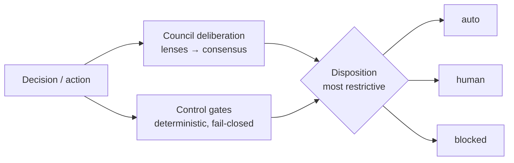

<!-- SPDX-License-Identifier: CC-BY-4.0 -->
# Control gates

The council deliberates; the **gates** decide what may actually proceed. They are a **deterministic,
fail-closed control layer that runs around the council** — a gate can **block or escalate an action
even when the council voted to proceed**. The recorded **disposition** is the *most restrictive* of
the council's route and the gate result.



## How a gate decides

Each gate is **policy over signals** (`eldercouncil/gate-policy.yaml`, copied to `.council/gate-policy.yaml`
at install — editable, version-control it). A gate **trips** when any of its `fail_closed_if`
conditions hold, or — on a high-impact action — when a required affirmation is missing. A tripped gate
yields one of: `allow_with_controls` (affirmations satisfied) · `escalate` (→ a human tier) · `block` ·
`human_required` (a non-overridable **hard stop**). **Unknown is never `allow`**: on a high-impact
action a gate that needs affirmative evidence and gets none **escalates**.

> **Honest scope.** The harness applies the policy deterministically over **signals**. Some signals it
> **computes** itself (`computed_by: harness`); the rest must be **asserted** by the host agent, tools,
> or lenses (`computed_by: asserted`). The harness does not magically detect everything — it enforces
> the policy you give it over the evidence it is given.

## The eleven gates

| Gate | Trips on | Result | Computed by |
|---|---|---|---|
| **Evidence** | material claim without a source; unresolved source conflict; not reproducible | escalate | asserted |
| **Confidence / Calibration** | low confidence on a high-impact call; uncalibrated output | escalate | asserted |
| **Action-Safety** | external/irreversible/destructive mutation (allowed *with controls* when an approver + rollback are supplied) | block / allow-with-controls | hybrid |
| **Data-Sensitivity** | secret/credential or PII detected; cross-border transfer unclear | escalate | hybrid |
| **Tool-Permission** | tool not allow-listed; credential scope too broad; action outside role | block | hybrid |
| **Legal / Compliance** | policy/jurisdiction/contract uncertainty; regulated-data handling | escalate | asserted |
| **Offensive-Cyber-Misuse** | request to generate exploits / payloads / evasion (defensive discussion is **not** a trip) | **HARD STOP** | hybrid |
| **Context-Integrity** | prompt-injection / context-rot / memory-poisoning suspected | escalate | hybrid |
| **Model-Disagreement** | material disagreement between lenses on a high-impact decision | escalate | hybrid |
| **Cost / Latency** | token/iteration/latency budget exceeded | escalate | hybrid |
| **Production-Change** | production/CI-CD mutation without change ticket, rollback plan, or named approver | block / allow-with-controls | hybrid |

**Offensive-Cyber-Misuse is a non-overridable hard stop** and is **always on in every profile** — no
approver can clear content that enables unauthorised access or exploitation. Its detector is
deliberately narrow (it keys on *generative* requests like "write a working exploit / payload"), so a
threat-hunting council legitimately discussing attacker TTPs is **not** a false positive; the primary
control is the host/lens-asserted `offensive_intent` signal.

## Profiles

| Profile | Maturity | Gates | For |
|---|---|---|---|
| **Lite** | 1–2 | the 4 foundational gates (evidence, confidence, action-safety, tool-permission) + the always-on hard stop | getting started; a Markdown checklist, no policy-as-code needed |
| **Standard** | 3–4 | all 11 | routine enterprise use; machine-readable gate decisions + audit |
| **Regulated** | 4–5 | all 11 **+ operational controls** (immutable logs, signed runbooks, authenticated approval API, circuit breakers, sandboxed execution, scoped credentials) | high-assurance / regulated sectors |

> "Regulated" is a **posture**, not a certification. Even at this profile the harness is
> OWASP-aware / NIST-aligned — **not compliant, not certified**, and it does not provide legal advice.
> Set the profile in `.council/config.toml` (`[governance] profile = …`) or `--profile`.

## Using the gates

```console
eldercouncil gates list                          # profiles + gate sets
eldercouncil gates check '{"action":"build an exploit payload"}'   # → hard stop, exit 2
eldercouncil convene code-council --demo --profile standard        # shows the gate outcomes + disposition
```

The pre-tool hook (`eldercouncil gate <ide>`) runs the **detector** gates (offensive hard-stop,
secrets, injection) so a blatant offensive request is stopped before the tool runs; the full gate set
runs at decision time, where the council context and asserted signals exist. See
[ARCHITECTURE.md](ARCHITECTURE.md) for where gates sit in the loop, and [../THREAT_MODEL.md](../THREAT_MODEL.md)
for the adversarial threats to the gate layer itself.
